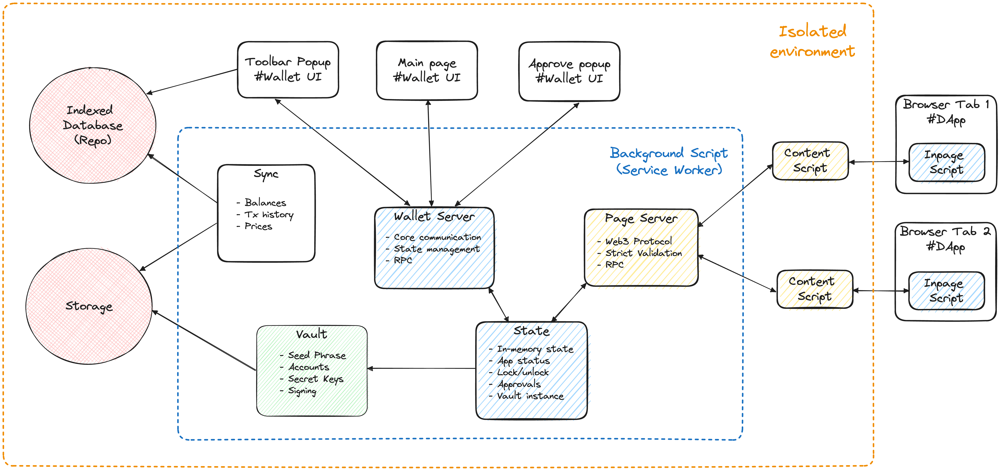

# Wigwam Web Extension Wallet - General Tech Documentation

## Architecture

## Security and Isolation

The architecture of the web3 extension places a strong emphasis on security and isolation:

- Sensitive operations, such as private key management and transaction signing, are handled exclusively in the secure background script.

- Content script isolation prevents direct access to the web page's JavaScript context, reducing the risk of malicious interference.

- User data and private keys are encrypted and stored securely to protect against unauthorized access.

- Permission requests are limited to only those necessary for the extension's functionality, ensuring user data privacy.

## Components

### 1. Inpage Script

The inpage script is a JavaScript code snippet that is injected into the context of a web page when the user activates the extension. This script allows the wallet to interact directly with the web page, enabling actions such as displaying account address, signing transactions, and interacting with DApps.

### 2. Content Script

The content script operates in an isolated environment separate from the web page's JavaScript context. It serves as a secure bridge between the inpage script and the background script. Its primary purpose is to facilitate communication and data exchange between these two components.

### 3. Background Script

The background script is the core engine of the extension. It operates independently in the background, managing critical functions such as account management, transaction signing, and communication with blockchain nodes. It also handles encryption and decryption of sensitive data, ensuring the security of private keys.

### 4. Popup and User Interface (UI)

The popup and user interface components provide the user with a graphical interface for managing their wallet. This includes features like viewing account details, initiating transactions, and adjusting settings. The UI is designed for ease of use and a seamless user experience.

### 5. Browser API

The extension utilizes browser APIs to interact with the browser itself. This includes features such as storage access, permission requests, and integration with browser settings.

### 6. External APIs and Blockchain Nodes

To interact with the Ethereum blockchain and other Web3 services, the extension may make use of external APIs and connect to blockchain nodes. These external services enable blockchain data retrieval, transaction broadcasting, and contract interactions.

## Entities

### Account (Wallet)

TIP: In the user interface and internationalization, the term "Wallet" is always used, while within the technology, the term "Account" is used, even though they refer to the same concept.

An "Account" is an entity that always has an address (EVM) and other parameters that represent it, such as a name, which is common to all accounts, and, depending on the account type, additional fields like derivation path, public key, and so on.

These account parameters are configured during the onboarding process and are subsequently stored in an encrypted form inside the [Vault instance](../src/core/back/vault/).

### Network

- [Add network guide](./add-network.md)

A "Network" is a set of parameters that describe the blockchain to which a wallet is connected and against which information such as balances is displayed.

The predefined set of networks can be found in [fixtures/networks](../src/fixtures/networks/). They are categorized by brands, each containing several networks, including both the mainnet and testnet.

Each network has a unique `chainId`, which is unique for each blockchain, whether it's the mainnet or a testnet.

Every network possesses a set of `rpcUrls`, which are endpoints for blockchain nodes.

In app, these networks are stored in Indexed DB, and users have the option to add custom networks.

### Approval

This entity is stored in the application's memory during its active operation. It is a structure describing an action that the user must confirm. For example, a transaction request, a digital signature, or connecting to a decentralized application.

### Activity

"Activity" is a record of a user's interactions with their wallets. It's simply a historical item stored in local storage (indexed DB). Users can add activities manually or synchronize them with third-party indexers. These activities are useful for tracking transaction histories and other user actions associated with their wallets.

## Project strucrture

### Assets (static files or templates)

- [`public/manifest.json`](../public/manifest.json) - The extension configuration file and the main entry point of the app. This file is a template with parameters such as `pkg`, `env`, `envBadge`, and `website`. And it allows for the separation of configurations for different browsers using special keys like `{ __chrome__version: "1.0.0", __firefox__version: "0.1.0.0" }`.

- [`public/icons`](../public/icons) - Images used as the extension's icon, as well as those that can be used not only in JavaScript, such as network/currency icons.

- [`public/locales`](../public/locales) - Content for internationalization (i18n). Provided in [JSON format](https://www.i18next.com/misc/json-format#i18next-json-v2), - as outlined in the i18next JSON v2 format, but without nesting. It will be bundled into the browser extension's version during the build process.

- [`public/sw.js`](../public/sw.js) - The entrypoint for extension background worker, aka "backend". Since ManifestV3 this is a Service Worker.
- [`public/main.html`](../public/main.html) - The main view for extension self tabs.
- [`public/popup.html`](../public/popup.html) - The extension popup view, browser toolbar.
- [`public/approve.html`](../public/approve.html) - The view for transaction approvals, popup that opened as a separate window.

### Source code entrypoints

- [`src/back.ts`](../src/back.ts) - The entry script for background worker. Will be bundled using `public/sw.js` as template.
- [`src/{main,popup,approve}.tsx`](../src/main.tsx) - The scripts that bundled and added to the corresponding html views. Just the regular react app, but different for each.
- [`src/{content,inpage}.ts`](../src/content.ts) - The "content scripts" that used for Web3 protocol, to communicate with decentralized applications. Will be injected in the browser tabs at runtime.
- [`src/version.ts`](../src/version.ts) - Also the "content script", but used to communicate with the wallet website. For example to understand on website is wallet already installed or not.

### Source code dirs

- [`src/_dev`](../src/_dev/) - This directory contains development tools such as hot reload, typings, and other non-essential items.
- [`src/fixtures`](../src/fixtures/) - The configs and some default or constant values.
- [`src/app`](../src/app/) - The UI for the app. React application + TailwindCSS.
- [`src/core`](../src/core/) - This core business logic, encompassing several components:
  1. [`common/`](../src/core/common/): Houses utilities shared between both the backend and client-side.
  2. [`back/`](../src/core/back/): Comprises the background script portion.
  3. [`client/`](../src/core/client/): Provides wrappers and utilities for facilitating communication between the user interface and the business logic.
  4. [`repo/`](../src/core/repo/): Represents the Indexed Database using Dexie.js.
  5. [`inpage`](../src/core/inpage/): Contains the code intended to run in the browser page, specifically for the Web3 protocol.
- [`src/lib`](../src/lib/) - The modules that are independent from the main project's business logic, such as wrappers and utilities. Or, in other words, modules that could be separate npm packages.

## Dependencies

Only the major dependencies are described.

### Core:

- [Web extension API](https://developer.mozilla.org/en-US/docs/Mozilla/Add-ons/WebExtensions)
- [bignumber.js](https://mikemcl.github.io/bignumber.js/)
- [dexie](https://dexie.org/)
- [kdbxweb](https://github.com/keeweb/kdbxweb)
- [effector (basic usage)](https://effector.dev/)
- [ethers](https://docs.ethers.org/v5/)

### Front-end:

- [React](https://react.dev/)
- [tailwindcss](https://tailwindcss.com/)
- [jotai](https://jotai.org/)
- [radix-ui](https://www.radix-ui.com/)
- [final-form](https://final-form.org/)

### Tooling

- [Webpack](https://webpack.js.org/)
- [TypeScript](https://www.typescriptlang.org/)
- [SWC](https://swc.rs/)
- [Jest](https://jestjs.io/)
- [EsLint](https://eslint.org/)
- [Prettier](https://prettier.io/)
- [lint-staged](https://github.com/okonet/lint-staged)
- [GitHub Workflows](https://docs.github.com/en/actions/using-workflows)
